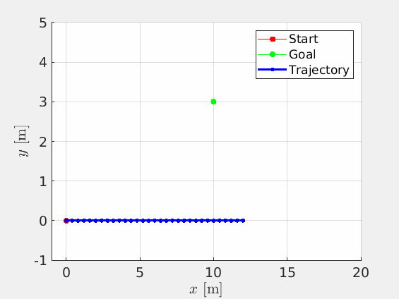
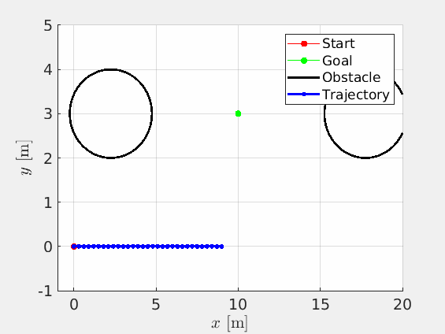

# Optimal control of nonlinear dynamical systems using iterative linear quadratic regulator (ILQR)

Algorithms:
1. ILQR for solving the open-loop problem - (ILQR_sample.m)
2. Model predictive control using ILQR - (mpc_main.m)
3. Infinite horizon control using ILQR - (infinite_horizon_main.m)

Models available:
1. Simple pendulum
2. Cart-pole
3. 1D nonlinear system (1dcos)

Related publications to cite if you use our work:

1. Mohamed, M. N. G., Goyal, R., & Chakravorty, S. An Optimal Solution to Infinite Horizon Nonlinear Control Problems. Accepted in IEEE Conference on Decision and Control (CDC) (2023).  ArXiv preprint: https://arxiv.org/abs/2304.00375.
2. Wang, R., Parunandi, K. S., Sharma, A., Goyal, R., & Chakravorty, S. (2021, December). On the search for feedback in reinforcement learning. In IEEE Conference on Decision and Control (CDC) (pp. 1560-1567) (2021). ArXiv preprint: https://arxiv.org/abs/2002.09478

